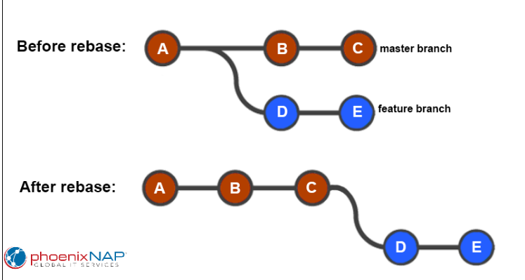

##### GIT commands ####$_COOKIE

1. Install GIT

sudo apt-get update
sudo apt-get install git -y

Check the version

git --version

On RHEL try with below

sudo yum install update
sudo yum install -git -y
git --version

2. Git configurations

git config --list ## check the configuration list

 whenever you install git first thing is you need to configure the username and email address

 git config --global user.email "devopsadk@gmail.com"
 git config --global username "DEVOPS ADK"

 verify using 
 
 git config --list

 git config --global -list

 git config --global -edit ## to edit settings

 3. In GIT there  are 2 repos 
    1. Bare -- Remote repository
    2. Non bare -- Local repository

4. Create a non bare (local repositor)
    git init dirname # Git is initialized and this creates a hidden folder, .git which contains the plumbing needed for the git to work

5. git ls -a 
   git status
   git add . ## add files to staging area
   git commit -m "Commit message" ## This will add the files to local repository

6. Observe the commit history using
git log
git log --oneline

To view entire history of the commit id

git show commitid

HEAD is the latest commit id

git log -1
git log --oneline -1
git log --oneline -3  # These show latest logs

## Check a log file by searching a word from a commit message

git log --oneline --grep "file"

Creating a BARE Repository or Remote repository
-------------------------------------------------

mkdir gitrepo
cd gitrepo
git init --bare remote.git
ls
cd remote

It is a bare MASTER

-------------------------

Cloning

git clone remote.git wsp1
cd wsp1

git pull # get the latest updates from remote to local

-----------------------

open git hub.com and create a repository and in the client on your desktop use below command to map
git remote add origin https://github.com/w3schools-test/hello-world.git

Now we are going to push our master branch to the origin url, and set it as the default remote branch:
git push --set-upstream origin master

git remote -v ## Displays the list of repos linked 

git remote remove origin ## This will remove remote origin

git push origin master  ## This will push changes from local repo to github remote

-------

vi .gitignore
create a file and add names which can remain tracked and ignore to be pushed

---------

git commit -a -m "new file" # if you use -a then no need to execute git add command

------

git remote show origin ## shows the origin git poiting to

git remove origin

git push origin master

git clean -n -- Preview changes to be removed

git clean -f -- remove new files which are not yet added to repository
-------
Branches

git branch -- displays all local branches
git branch -r -- display remote branch
git branch -a -- displat all local and remote branch

git branch branchname -- to create branch

git branch -v ---------- This will show all the branch and the current branch your in

git checkout branchname

git checkout -b branchname # create and switch to new branch

git branch --show-current

git reset filename -- To untrack the tracked files (Revert back to working area from staging area)

 git restore --staged a ----- To untrack the tracked files (Revert back to working area from staging area)

 git revert <commit id> -- This will revert changes commited in that particular commit id

 If your facing issues to move to previous commit due to conflict but you still want to move then use

 git reset 89f6c3d --hard

 git branch -d Gbranch -- To delete branch

 ----------------------------------------------------------------------------------------------
 Merge process

 First, checkout to Master

 git checkou master

 git merge win master ------- Now win branch is merged with master

 -----------------------------------------------------------------------------------------------

Push all branches to remote repository

git push --all

-----------------------------------------------------------------------------------------------

git rebase explained in simple words with example

Rebasing in Git is a process of integrating a series of commits on top of another base tip. It takes all the commits of a branch and appends them to the commits of a new branch.

The main aim of rebasing is to maintain a progressively straight and cleaner project history. Rebasing gives rise to a perfectly linear project history that can follow the end commit of the feature all the way to the beginning of the project without even forking. This makes it easier to navigate your project

Example :

manoj@MYSYSTEM MINGW64 /e/newreb (master)
$ git log --oneline
f007374 (HEAD -> master) Initial readme commit on master

git checkout -b branch1

touch a

 git add . && git commit -m "Initial commit on branch created and added A file"

manoj@MYSYSTEM MINGW64 /e/newreb (branch1)
$ git log --oneline
dcfa4cc (HEAD -> branch1) Initial commit on branch created and added A file
f007374 (master) Initial readme commit on master

 git rebase branch1 master ## Here we are moving contents from branch1 (feature branch) to master branch

manoj@MYSYSTEM MINGW64 /e/newreb (master)
$ git log --oneline
dcfa4cc (HEAD -> master, branch1) Initial commit on branch created and added A file
f007374 Initial readme commit on master

