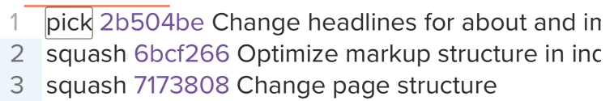

git commands

1. Create repository

 mkdir myproject1
 cd myproject1
 git init

 now repository is created

 2.  create index.html file and store in the directory . If u hit ls we can see files
     Now Git is aware of the file, but has not added it to our repository!

     Files in your Git repository folder can be in one of 2 states:

    Tracked - files that Git knows about and are added to the repository
    Untracked - files that are in your working directory, but not added to the repository
    When you first add files to an empty repository, they are all untracked. To get Git to track them, you need to stage them, or add them to the staging environment.

3. Git Staging Environment
One of the core functions of Git is the concepts of the Staging Environment, and the Commit.

As you are working, you may be adding, editing and removing files. But whenever you hit a milestone or finish a part of the work, you should add the files to a Staging Environment.
Staged files are files that are ready to be committed to the repository you are working on

4.  git add index.html -- so that the file is moved to staging and getting tracked
    now you can check using  git status

5.  If there are multiple files you can add git add - all

git commit -m "First release of Hello World!"

6.  creating a branch
    git branch branch-name

7.  git log to view the status

8. create a git branch git branch branch-name

9.  git branch this will give new branch created

10. checkout is the command used to check out a branch. Moving us from the current branch, to the   one specified at the end of the command
   git checkout new-branch
11.  to merge we need to come to master branch then merge
     git checkout master
     git merge branchname so that branch gets merged with the master and master will be updated 
12. delete branch git branch -d branchname
    git branch -r -- list all the remote branches
    git branch -a -- list all the local branches

    Create and switch to new branch
    git checkout -b emergency-fix

13. open git hub.com and create a repository and in the client on your desktop use below command to map
git remote add origin https://github.com/w3schools-test/hello-world.git

Now we are going to push our master branch to the origin url, and set it as the default remote branch:
git push --set-upstream origin master

14. Now local repository contents are moved to github and new files added can be pushed to repository using
 git push command

 15. Git pull from git hub
      git fetch origin
      git diff origin/master
      git merge origin/master
      git pull origin
16. Push to git hub
      git push origin

17. Pull a branch created on the github
    
    mybranch1 is created on the github

    on local repository if we hit command git branch we wont see the branch created on the github
    use git branch -a then we will see the branch name create on the git hub
    check out to the newly created branch git checkout mybranch1 then hit command git pull now the branch is pulled .. check using git branch

18. Push branch to git hub

    create a branch on the local git repo

    git checkout -b mylocalbranch
    create a files
    git push origin mylocalbranch

19. Revert back to any step
    first use git logs -- oneline
    then git commit #number

20. Suppose if I have a branch in local and want to push to remote then use below command
     git push -u origin linux   (Here linux ix the branch)

     Suppose if I want to move all the branches the
     git push --all

21. git branch - Will display all the branches
22. git branch -r -- will display the remote branch
23. git branch -a -- will display both remote and local
24. git branch -d prod -- Delete the branch here prod branch is deleted this is for deleting local branch
25. git push origin -d test -- This is to delete remote branch

26. cherry pick - We are moving only particular commit id from one branch to other 

    git log --oneline
    git cherry-pick 204413c 97ffbac

27. Merge follows the timestamp
    Rebase follow top of the commit history

    If you want to merge as per the commit history then follow below steps
    1. suppose if you want to merge dev branch with master
    git rebase master
    git checkout master
    git merge dev master
    check using 
    git log --oneline
28. Squashing -- Process of adding multiple commit id under one commit id

    git rebase -i HEAD~3

and save

29. Ammend will add previous commits and no squashing is required with this option :)  

    